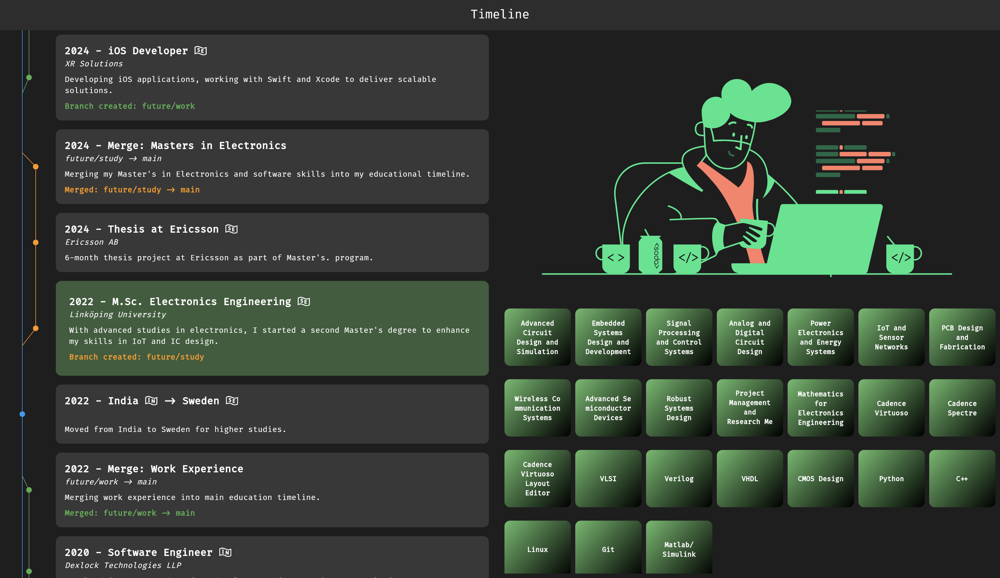

# Flutter Portfolio App

This is a **demo** portfolio web application created for study purposes. The app showcases various projects and experiences, featuring a modern UI for navigating through a timeline of activities and portfolio items.

Built with 💚 **Flutter**, this project focuses on web development, offering a smooth and responsive user experience.

If you enjoy this project, please consider leaving a ⭐ on the [GitHub repository](#). Your support helps increase its visibility and encourages further development.

## Features

- **Home Screen**: Display a landing page with a professional introduction.
- **Timeline**: Navigate through a visual timeline of career milestones and key achievements.
- **Skills Page**: View a dedicated page showcasing technical and professional skills.
- **Projects Page**: Explore various personal and professional projects with detailed descriptions.
- **Responsive Design**: The app is optimized for landscape viewing and adjusts seamlessly for different screen sizes.

## Demo

You can view the live demo of the portfolio app by clicking the button below:

## Screenshots and GIF

### Home Screen (GIF)

### Home Screen (Screenshot)

### Timeline Page (Screenshot)

## Packages Used

This project uses the following Flutter packages:

- [`go_router: ^14.2.7`](https://pub.dev/packages/go_router): For routing and navigation.
- [`flutter_animate: ^4.5.0`](https://pub.dev/packages/flutter_animate): For smooth animations.
- [`google_fonts: ^4.0.3`](https://pub.dev/packages/google_fonts): To easily use Google Fonts.
- [`url_strategy: ^0.2.0`](https://pub.dev/packages/url_strategy): For better URL handling in Flutter web apps.
- [`uuid: ^3.0.7`](https://pub.dev/packages/uuid): For generating unique IDs.
- [`provider: ^6.1.2`](https://pub.dev/packages/provider): For state management.
- [`lottie: ^3.1.2`](https://pub.dev/packages/lottie): To display Lottie animations.
- [`flutter_hooks: ^0.18.0`](https://pub.dev/packages/flutter_hooks): To simplify the use of stateful widgets.
- [`flutter_staggered_animations: ^1.1.1`](https://pub.dev/packages/flutter_staggered_animations): For staggered animations.
- [`url_launcher: ^6.1.2`](https://pub.dev/packages/url_launcher): To launch URLs.

## Usage and Copyright

This app was developed as a **demo** project for learning and demonstrating Flutter capabilities. All content, including code and assets, is used for **study purposes** only.

## Getting Started

### Prerequisites

- [Flutter SDK](https://flutter.dev)
- [Dart SDK](https://dart.dev)
